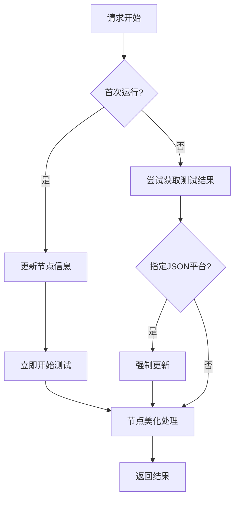

# Sub-Store-Lab 🧪

> ⚠️ **注意**：本项目正在开发中，尚未经过长久测试，不建议在生产环境中使用。

## 📚 项目介绍

Sub-Store-Lab 是一个用于订阅节点管理、测试和美化的工具框架。它通过与 Sub-Store 解耦的方式，提供节点美化、排序以及性能测试功能。

### ✨ 主要功能

- 🚀 **速率测试** - 测试节点的下载速度和延迟
- 🔍 **纯净度测试** - 检测节点的质量和可用性
- 🎨 **节点美化** - 优化节点名称显示
- 📊 **智能排序** - 根据测试结果对节点进行排序
- ⚙️ **高度可配置** - 通过 conf 选项自定义各种参数

## 📸 效果展示

TODO

## 📚 说明

### 🛠️部署流程

建议使用 docker-compose 进行部署，参考如下配置：

```yml
services:
    sub-store:
        image: xream/sub-store:http-meta
        container_name: sub-store
        restart: always
        volumes:
        - ./data/sub-store-data:/opt/app/data
        environment:
        - SUB_STORE_FRONTEND_BACKEND_PATH=/backend // 自行随机生成
        ports:
        - "8001:3000"
    sub-store-lab:
        image: ocyss/sub-store-lab:latest
        container_name: sub-store-lab
        restart: always
        env_file:
        - .env
        volumes:
        - ./data:/opt/app/data
```

后端地址则为 service_name:8000, `http://sub-store-lab:8000`

### 🛠️使用方法

通过脚本操作实现与 Sub-Store 框架的解耦，示例代码：

```javascript
async function operator(...args) {
    const resp = await fetch("http://127.0.0.1:8000", {
        method: "POST",
        headers: {
            "Content-Type": "application/json",
        },
        body: JSON.stringify({
            conf: {
                // 可选配置项
            },
            args
        }),
    }).then(r => r.json())
    return resp
}
```

### 🔄 工作流程



## 📝 鸣谢

不分先后

- [VPS IP 质量检测完全指南：从小白到精通的实用教程 - idcflare.com](https://idcflare.com/t/topic/18792)
- [IP 质量 - 快速排查清单 - linux.do](https://linux.do/t/topic/997322)

- [sub-store-org/Sub-Store](https://github.com/sub-store-org/Sub-Store)
- [beck-8/subs-check](https://github.com/beck-8/subs-check)
- [bestruirui/BestSub](https://github.com/bestruirui/BestSub)
- [oneclickvirt/ecs](https://github.com/oneclickvirt/ecs)
- [xykt/IPQuality](https://github.com/xykt/IPQuality)

- [AbuseIPDB](https://www.abuseipdb.com/)
- [IPAPI](https://ipapi.co/)
- [IPData](https://ipdata.co/)
- [IPinfo](https://ipinfo.io/)
- [IPQualityScore](https://www.ipqualityscore.com/)
- [IPRegistry](https://ipregistry.co/)

- ipify.org, amazonaws.com, ifconfig.me, ident.me, icanhazip.com, api.ip.sb, ipinfo.io, ipapi.co

## ⭐ 统计

[](https://starchart.cc/ocyss/sub-store-lab)
